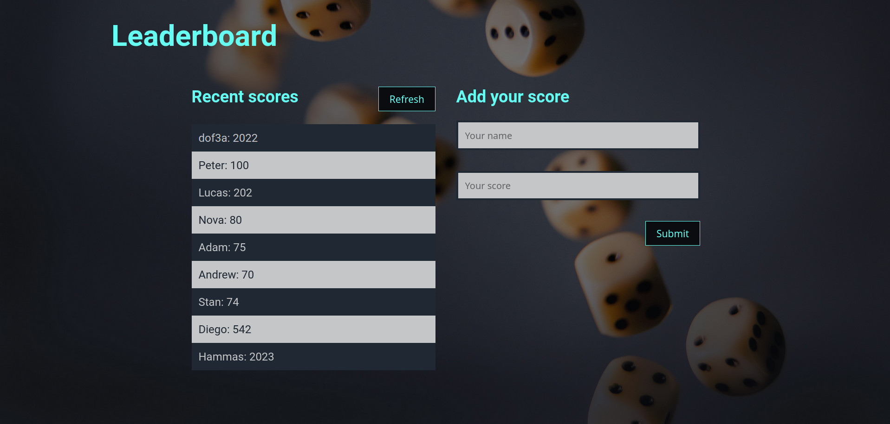

# Project Name

> Leaderboard

# Description

> A simple website displaying a leaderboard with a form to add new scores.

## Built With

- HTML
- JavaScript
- CSS
- Webpack

## Screenshots

## Live demo

Still in development ... Check this section later.

## Getting Started

To get a local copy up and running follow these simple example steps.

### Prerequisites
 - IDE(code editor) like: **Vscode**, **Sublime**, etc.  
 - [Git](https://www.linode.com/docs/guides/how-to-install-git-on-linux-mac-and-windows/)

### Setup
  1. Download the **Zip** file or clone the repo.
  2. Run a live server with "npm start" or open the html file directly from the "dist" folder
  3. you can access the code using VSCode or any similar software.

### Usage

## Authors

## 👤 Peter Beshara.

- GitHub: [@Peter1907](https://github.com/Peter1907)
- Twitter: [@Peter_Beshara_](https://twitter.com/Peter_Beshara_)
- LinkedIn: [LinkedIn](https://www.linkedin.com/in/peter-beshara-b33681241/)

## 🤝 Contributing

Contributions, issues, and feature requests are welcome!

Feel free to check the [issues page](../../issues/).

## Show your support

Give a ⭐️ if you like this project!

## Acknowledgments

- Background Photo by <a href="https://unsplash.com/@rihok?utm_source=unsplash&utm_medium=referral&utm_content=creditCopyText">Riho Kroll</a> on <a href="https://unsplash.com/s/photos/game?utm_source=unsplash&utm_medium=referral&utm_content=creditCopyText">Unsplash</a>

## 📝 License

This project is [MIT](./MIT.md) licensed.
